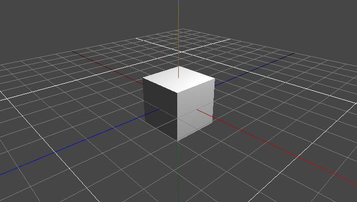

# Getting Started

This guide explains how to get YourGameLib, create a user project and run it.

## TL;DR

If you are in a hurry, grab the pre-initialized template [YourGameProject.zip](YourGameProject.zip) and jump to [Build the project](#build-the-project). You need `Git`, `CMake` and a `C/C++ compiler`, as mentioned below.

-   **Pro:** Fast, easy, `Python` **not** required
-   **Con:** Manually rename "YourGameProject" across multiple files

The recommended way for initializing a new project is following this guide, though.

## Requirements

The list of requirements for getting started:

-   `Git 1.7.0+`
-   `Python 3.5+` with
    -   `Jinja2`
    -   `gitpython`
-   `CMake 3.6+`
-   A common `C/C++ compiler` capable of C++11

## Installation

With YourGameLib, user projects get access to the YourGame API and a selected number of third-party libraries, to work with directly. YourGameLib is always built from source in user project context. 

Let's get the code by cloning the repository:

```bash
git clone --depth 1 https://github.com/duddel/yourgamelib.git
```

Installation done.

## Initialize a User Project

Initialize a new user project by running the `init.py` script from the just cloned `yourgamelib` directory. This creates the directory `./MyGame/` next to `./yourgamelib/` containing a couple of files derived from a template.

```bash
python ./yourgamelib/init.py MyGame
```

## Build the project

The user project in `./MyGame/` already contains some scripts starting with `build_[..]`, so we go straight ahead and try to build our project for the `desktop` platform by running a suitable build script.

```bash
cd MyGame
./build_desktop_debug.bash
```

If everything went fine, we now have an executable that renders something like this: a cube in a grid.



## Next Steps

Check out the examples, the API and other target platforms.
